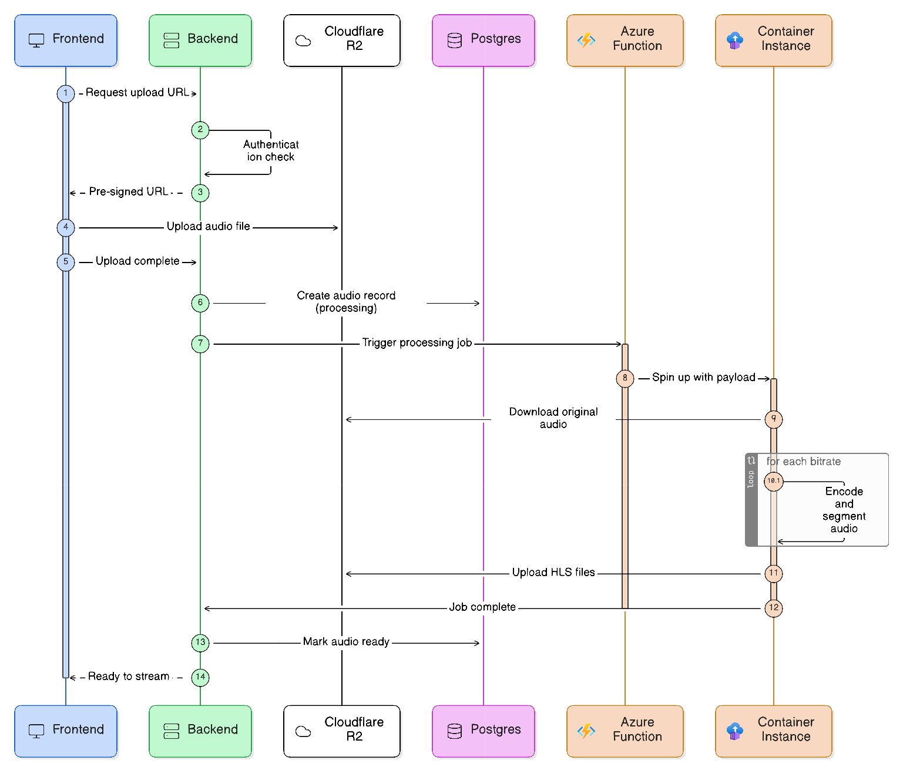

Vessel is a simple adaptive bitrate audio streaming pipeline (cum platform).

I am thinking of working on it in two phases which are as follows.

---

### Phase 1: The upload, transcode and cleanup

1. Job Start (Elysia):
   * User uploads to R2.
   * Elysia creates the DB record as processing.
   * Elysia starts the ACI and passes a unique Job ID as an environment variable to the container.

2. The Work (ACI):
   * The container downloads, transcodes, and uploads back to R2.
   * Success Path: At the very end of its script, the container sends a simple HTTP POST to backend:
   > curl -X POST https://your-api.com -d '{"jobId": "123", "status": "uploaded"}'
   * Failure Path: If the FFmpeg command fails, the script sends:
   > curl -X POST https://your-api.com -d '{"jobId": "123", "status": "failed"}'

3. Completion (Elysia):
   * The /webhooks/transcode-complete endpoint verifies the request and updates your Neon Postgres record to the final status (uploaded or failed).
   * Since that webhook endpoint is public, you should add a simple Secret Token in Headers (X-webhook-secret) and set them up at both places through environment variables. 

4. The Cron Job Logic
   * Logic: "Find any job with status processing that was created more than 20 minutes ago."
   * Action:
        1. Update those DB rows to failed.
        2. Use the Azure SDK to delete the ACI container group associated with that jobId.

---

### Phase 2: The straming platform

> Yet to research on this part, once I conclude the Phase 1 end to end, I will work on it. It should not take 4-5 prompts to opus to build this out because I already have my database authentication and related stuff in place so I just need a clean UI and a way to properly switch bitrate by checking user's network condition on frontend.

